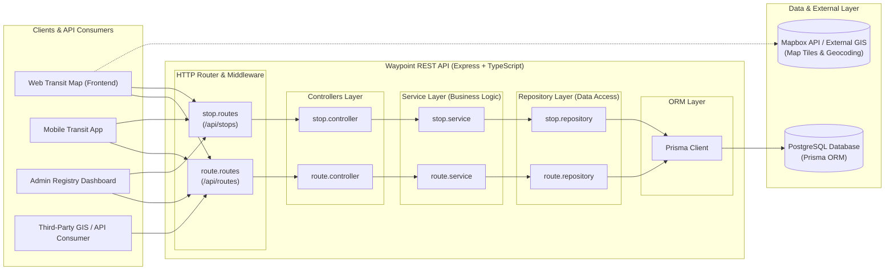
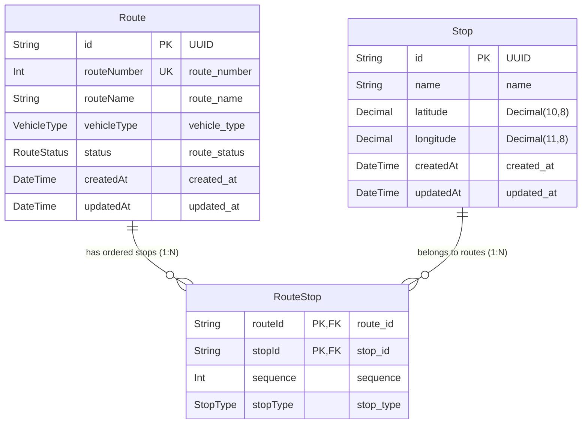

# Waypoint Architecture

This document details the system architecture, component breakdown, request lifecycle, and database ERD model for **Waypoint** — a geospatial public transportation registry API focused on Baguio City, Philippines.

---

## 1. System Overview

The system overview outlines the request lifecycle from external API clients and frontend applications through the Waypoint REST API layer down to the relational database persistence tier.

### Request Lifecycle Diagram

### Component Details

#### 1. Clients & API Consumers
- **Web Transit Map**: Client application visualizing public jeepney routes, terminals, and stops on an interactive map.
- **Mobile Transit App**: End-user commuter mobile app to search routes, locate nearby terminals, and view ordered route stops.
- **Admin Registry Dashboard**: Administrative interface for managing transport routes, physical stop locations, and stop sequence ordering.
- **Third-Party GIS / API Consumer**: External applications consuming Waypoint REST endpoints for public transportation data.

#### 2. Waypoint API Layer (Express.js + TypeScript)
- **HTTP Router & Middleware (`src/routes`)**: Defines RESTful HTTP endpoints (e.g., `POST /routes`, `GET /routes`, `GET /routes/:id/with-stops`) and manages request routing and error handling middleware.
- **Controllers Layer (`src/controllers`)**: Receives HTTP requests, validates request payloads, and delegates work to the service layer (`route.controller`).
- **Service Layer (`src/services`)**: Enforces core domain logic and validation rules, such as route number uniqueness and existence checks (`route.service`).
- **Repository Layer (`src/repositories`)**: Encapsulates data persistence operations and isolates Prisma query details from business logic (`route.repository`).
- **Prisma Client (`src/db/prisma.ts`)**: Type-safe database client managing queries, connections, and transactional operations to PostgreSQL.

#### 3. Persistence & External Layer
- **PostgreSQL Database**: Relational database engine storing Waypoint entities (`Route`, `Stop`, and `RouteStop`).
- **Mapbox API / External GIS**: External mapping and spatial services for map rendering and route visual rendering on client applications.

---

## 2. ERD Model (Entity Relationship Diagram)

The Waypoint data model consists of three core entities (`Route`, `Stop`, and `RouteStop`) creating a many-to-many relationship that preserves stop sequence and role classification along a transportation route.

### Entity Relationship Diagram

### Data Dictionary & Schema Definitions

#### 1. `Route` Model
Represents a public transportation route or service line (e.g., "PMA - Kias Line").

| Field | Type | Constraints | Description |
|---|---|---|---|
| `id` | `UUID` | Primary Key, Default: `uuid()` | Unique internal identifier |
| `route_number` | `Int` | Unique | Public transportation route number |
| `route_name` | `String` | Required | Human-readable route name |
| `vehicle_type` | `VehicleType` | Enum | Type of vehicle (`JEEPNEY`, `MODERNJEEP`, `TAXI`) |
| `route_status` | `RouteStatus` | Enum, Default: `ACTIVE` | Operating status (`ACTIVE`, `INACTIVE`, `UNKNOWN`) |
| `created_at` | `DateTime` | Default: `now()` | Record creation timestamp |
| `updated_at` | `DateTime` | Updated At | Record last update timestamp |

#### 2. `Stop` Model
Represents a physical geographic location associated with transportation routes.

| Field | Type | Constraints | Description |
|---|---|---|---|
| `id` | `UUID` | Primary Key, Default: `uuid()` | Unique internal stop identifier |
| `name` | `String` | Required | Name of the location, terminal, or landmark |
| `latitude` | `Decimal(10,8)` | Required | Geographic latitude coordinate |
| `longitude` | `Decimal(11,8)` | Required | Geographic longitude coordinate |
| `created_at` | `DateTime` | Default: `now()` | Record creation timestamp |
| `updated_at` | `DateTime` | Updated At | Record last update timestamp |

#### 3. `RouteStop` Model (Junction Table)
Connects `Route` and `Stop` in a many-to-many relationship while storing sequence order and stop role classifications.

| Field | Type | Constraints | Description |
|---|---|---|---|
| `route_id` | `UUID` | Foreign Key → `Route.id` | Associated route ID |
| `stop_id` | `UUID` | Foreign Key → `Stop.id` | Associated stop ID |
| `sequence` | `Int` | Required | 1-based index ordering stops along the route |
| `stop_type` | `StopType` | Enum | Role classification (`TERMINAL`, `INTERCHANGE`) |

**Composite Primary Key:** `(route_id, stop_id)`  
**Indices:**
- `@@index([route_id])`: Speeds up fetching all stops for a specific route in sequence order.
- `@@index([stop_id])`: Speeds up fetching all routes serving a specific stop location.

### Enumeration Types

#### `VehicleType`
- `JEEPNEY`: Traditional Public Utility Jeepney (PUJ).
- `MODERNJEEP`: Modernized Public Utility Vehicle (MPUV).
- `TAXI`: Metered public taxi.

#### `RouteStatus`
- `ACTIVE`: Route is currently operating.
- `INACTIVE`: Route is temporarily out of service.
- `UNKNOWN`: Unconfirmed route status.

#### `StopType`
- `TERMINAL`: Terminal / Start / End point of a route.
- `INTERCHANGE`: Transfer point between routes.
